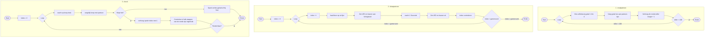

 # Project 210 Game Logic Flowcharts

```mermaid
graph TD
    %% ----- CREATPATROON -----
    subgraph creatpatroon [1. creatpatroon]
        C_Start([Start]) --> C_Loop{Loop}
        C_Loop --> C_Random[Kies willekeurig getal 1 t/m 4]
        C_Random --> C_Add[Voeg getal toe aan patroon-lijst]
        C_Add --> C_Inc[Verhoog de ronde-teller lengte + 1]
        C_Inc --> C_Check{teller < 100}
        C_Check -- teller < 100 --> C_Loop
        C_Check -- ja --> C_End([Einde])
    end

    %% ----- SHOWPATROON -----
    subgraph showpatroon [2. showpatroon]
        S_Start([Start]) --> S_Init[index = 0]
        S_Init --> S_Loop{Loop}
        S_Loop --> S_Inc[index ++]
        S_Inc --> S_Get[haal kleur op uit lijst]
        S_Get --> S_On[Zet LED en buzzer aan licht/geluid]
        S_On --> S_Wait[wacht 1 Seconde]
        S_Wait --> S_Off[Zet LED en buzzer uit]
        S_Off --> S_Comp[index controleren]
        S_Comp --> S_Check{index < gameround}
        S_Check -- index < gameround --> S_Loop
        S_Check -- index = gameround --> S_End([Einde])
    end

    %% ----- CHECK -----
    subgraph check [3. check]
        K_Start([Start]) --> K_Init[index = 0]
        K_Init --> K_Loop{Loop}
        K_Loop --> K_Wait[wacht op knop druk]
        K_Wait --> K_Comp[vergelijk knop met patroon]
        K_Comp --> K_CheckMatch{Klopt het?}
        
        K_CheckMatch -- nee --> K_Fail[Speel verlies-geluid af bij fout]
        K_Fail --> K_End([Einde])
        
        K_CheckMatch -- ja --> K_Inc[verhoog speler index met 1]
        K_Inc --> K_StepCheck[Controleer of alle stappen van de ronde zijn ingedrukt]
        K_StepCheck --> K_RoundCheck{Ronde klaar?}
        
        K_RoundCheck -- nee --> K_Loop
        K_RoundCheck -- ja --> K_End
    end
```
