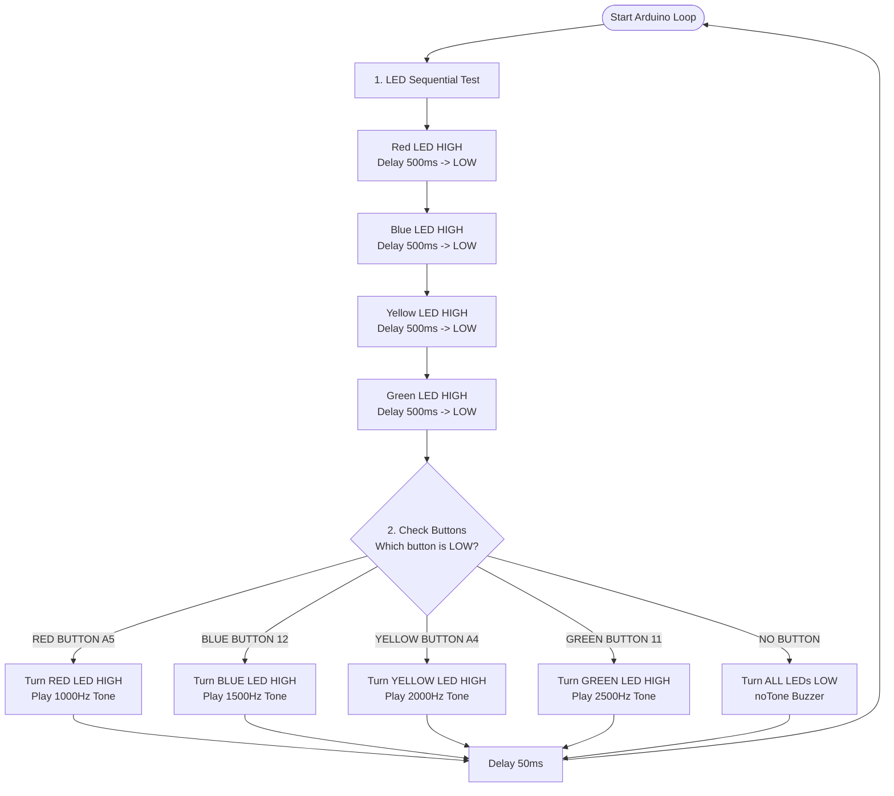

 # 100% Accurate Project 210 Activity Diagram

```mermaid
graph TD
    Start([Start Arduino Loop]) --> LEDTest[1. LED Sequential Test]
    
    LEDTest --> RedOn[Red LED HIGH<br>Delay 500ms -> LOW]
    RedOn --> BlueOn[Blue LED HIGH<br>Delay 500ms -> LOW]
    BlueOn --> YellowOn[Yellow LED HIGH<br>Delay 500ms -> LOW]
    YellowOn --> GreenOn[Green LED HIGH<br>Delay 500ms -> LOW]
    
    GreenOn --> ButtonCheck{2. Check Buttons<br>Which button is LOW?}
    
    ButtonCheck -->|RED BUTTON A5| ActionRed[Turn RED LED HIGH<br>Play 1000Hz Tone]
    ButtonCheck -->|BLUE BUTTON 12| ActionBlue[Turn BLUE LED HIGH<br>Play 1500Hz Tone]
    ButtonCheck -->|YELLOW BUTTON A4| ActionYellow[Turn YELLOW LED HIGH<br>Play 2000Hz Tone]
    ButtonCheck -->|GREEN BUTTON 11| ActionGreen[Turn GREEN LED HIGH<br>Play 2500Hz Tone]
    ButtonCheck -->|NO BUTTON| ActionNone[Turn ALL LEDs LOW<br>noTone Buzzer]
    
    ActionRed --> LoopEnd[Delay 50ms]
    ActionBlue --> LoopEnd
    ActionYellow --> LoopEnd
    ActionGreen --> LoopEnd
    ActionNone --> LoopEnd
    
    LoopEnd --> Start
```
