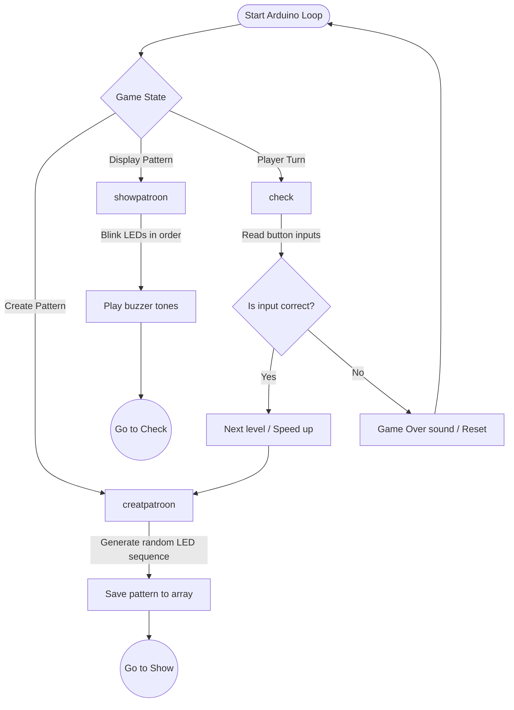

 # Arduino Pattern Game Diagram

```mermaid
graph TD
    Start([Start Arduino Loop]) --> MainMenu{Game State}
    
    MainMenu -->|Create Pattern| Step1[creatpatroon]
    Step1 -->|Generate random LED sequence| Step2[Save pattern to array]
    Step2 --> Transition1((Go to Show))
    
    MainMenu -->|Display Pattern| Step3[showpatroon]
    Step3 -->|Blink LEDs in order| Step4[Play buzzer tones]
    Step4 --> Transition2((Go to Check))
    
    MainMenu -->|Player Turn| Step5[check]
    Step5 -->|Read button inputs| Step6{Is input correct?}
    
    Step6 -- Yes --> Step7[Next level / Speed up]
    Step7 --> Step1
    
    Step6 -- No --> Step8[Game Over sound / Reset]
    Step8 --> Start
```
